# PLAMIO

> **AI-Friendly Game Framework**

A lightweight game framework designed for AI-assisted game development.

------------------------------------------------------------------------

# Features

-   AI-friendly public API
-   Portable game code across supported platforms
-   Unified Graphics / Input / Audio / Storage APIs
-   Fixed 30 FPS game loop
-   Built-in SaveData helper
-   Camera & viewport support
-   PWM / I2S audio support
-   SSD1306 / ILI9341 display support
-   AI-oriented documentation and API design

- **Supported platforms**
  - Raspberry Pi Pico family (RP2040 / RP2350)
  - ESP32 (planned)
  

| Hardware |  |
| :---: | :---: |
| 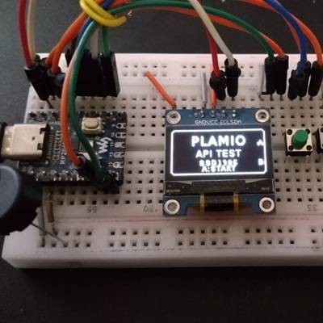 | 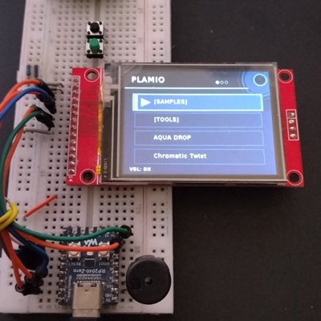 |
| 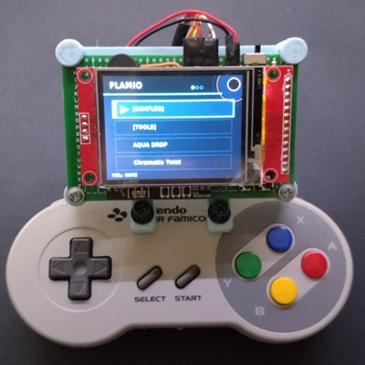 | 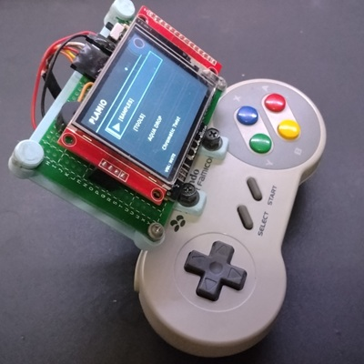 |

| ScreenShots | |
| :---: | :---: |
| 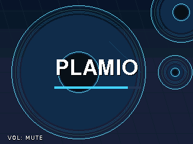 | 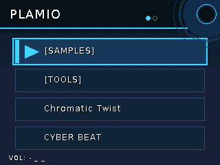 |
| 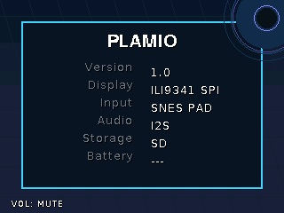 | 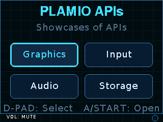 |
| 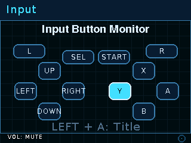 | 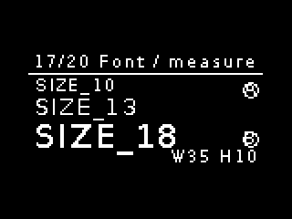 |
| 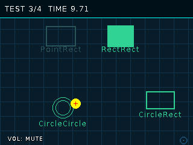 | 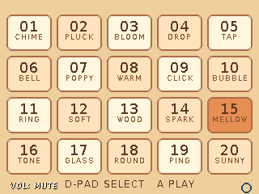 |
| 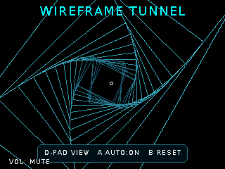 | 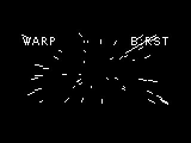 |
| 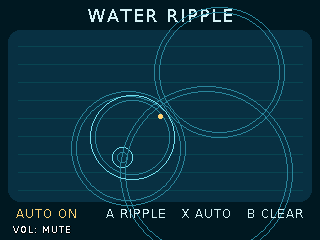 | 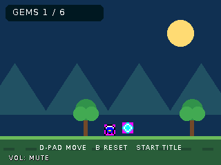 |
| 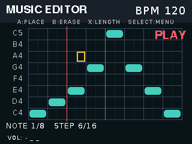 | 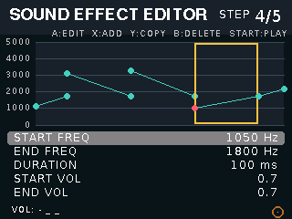 |
| 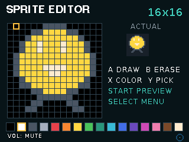 | 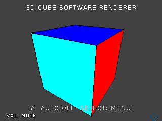 | 
| 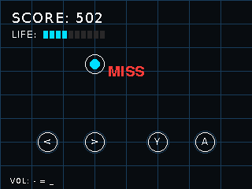 | 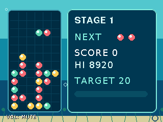 |
| 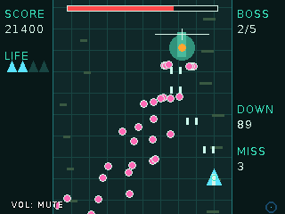 | 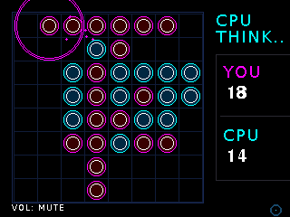 |
| 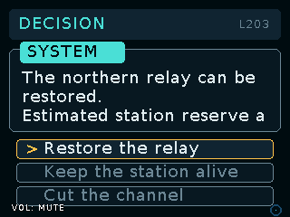 | |

------------------------------------------------------------------------

# Philosophy

PLAMIO is designed so that both humans and AI can write games using the
same simple API.

Games implement only a small set of interfaces while the runtime manages
graphics, input, audio, storage, and the game loop.

This allows game logic to remain clean, portable, and easy to generate.

------------------------------------------------------------------------

# Sample Games

| Sample | Description |
|--------|-------------|
| 01 PLAMIO APIs | Learn the basic APIs |
| 02 Collision Lab | Collision detection |
| 03 SoundTile | Audio and input |
| 04–06 Graphics Effects | Animation techniques |
| 07 Sprite Adventure | Sprite rendering |
| 08–10 3D Samples | Advanced rendering |
| 11 SL | Bonus sample |
| GameTemplate | Empty project template |

## Learning Path

The samples are intended to be completed in numerical order.
Each sample introduces one or more new concepts while building on previous examples.

------------------------------------------------------------------------

# Build Requirements

## Required tools

-   Raspberry Pi Pico SDK
-   CMake
-   Ninja
-   Arm GNU Toolchain

------------------------------------------------------------------------

# Required Libraries
  
- [LovyanGFX](https://github.com/lovyan03/LovyanGFX)
- [pico-extras](https://github.com/raspberrypi/pico-extras) (required for I2S audio)
- [pico_audio_i2s_32b](https://github.com/elehobica/pico_audio_i2s_32b) (required for I2S audio)
- [no-OS-FatFS-SD-SDIO-SPI-RPi-Pico](https://github.com/carlk3/no-OS-FatFS-SD-SDIO-SPI-RPi-Pico) (required for SD storage)  

``` text
PLAMIO/
├── games/
├── system/
└── lib/
    ├── LovyanGFX/
    ├── pico-extras/
    ├── pico_audio_i2s_32b/
    └── no-OS-FatFS-SD-SDIO-SPI-RPi-Pico/
```

------------------------------------------------------------------------

# Configuration

## Hardware Configuration

PLAMIO uses hardware profiles to describe the complete hardware configuration of a board.

Select the hardware profile in the `###### ENVIRONMENT START ######` section of `CMakeLists.txt`.

```cmake
set(PLAMIO_PIN_CONFIG_DEFAULT "system/platform/pico/boards/WaveShare_RP2040-ZERO.h")
```

Hardware profiles are stored in:

```text
system/platform/pico/boards/
```

Each profile defines the board-specific hardware settings, including graphics, input, audio, storage, battery, and pin assignments.

To support a new board, create a new hardware profile in this directory and select it in `CMakeLists.txt`.

## Project Configuration

Edit the `###### ENVIRONMENT START ######` section in the root `CMakeLists.txt` to configure the project's default settings.

Available options include:

- Target board (`RP2040`, `RP2350`)
- Display (`ILI9341`, `SSD1306`)
- Storage (`SD`, `NONE`)
- Audio (`PWM`, `I2S`, `NONE`)
- Input (`GPIO_BUTTONS`, `SNES`)
- Japanese font (`ON`, `OFF`)
- PSRAM (`ON`, `OFF`)
- Sample projects (`ON`, `OFF`)

For example:

```cmake
set(PLAMIO_TARGET_DEFAULT "RP2040")
set(PLAMIO_DISPLAY_DEFAULT "ILI9341")
set(PLAMIO_AUDIO_DEFAULT "PWM")
```

These values define the project's default configuration and can be overridden from the command line using CMake options.

------------------------------------------------------------------------

## Build

Build the project with CMake:

```sh
cmake -S . -B build
cmake --build build
```
------------------------------------------------------------------------

## Deployment

After building, the generated firmware can be found at:

```text
build/system/plamio.uf2
```

Copy the UF2 file to a board in BOOTSEL mode to install the firmware.

VSCode tasks or custom scripts can also be used to automate the deployment process.

------------------------------------------------------------------------

# Creating a Game

To create a game, simply create **one class** that inherits from the `PLAMIO::Game` class.

The PLAMIO system automatically manages the game loop, rendering, input, audio, and storage.

Your game only needs to implement its own game logic.

## Core API

PLAMIO provides the following hardware abstraction interfaces to every game.

Game code does not need to access platform-specific hardware or drivers directly.

| Class | Purpose |
|------|---------|
| `PLAMIO::Graphics` | Drawing API for text, shapes, images, and sprites. |
| `PLAMIO::Input` | Controller input, button state, repeat, and hold detection. |
| `PLAMIO::Audio` | Play sound effects and music. |
| `PLAMIO::Storage` | Read and write save data and configuration files. |

For the complete API reference, see:

- `sdk/PLAMIO.h`

## `PLAMIO::Game` class

Your game class should inherit from the `PLAMIO::Game` class.

Most games implement their game logic in:

- `onInit()`
- `onUpdate()`
- `onDraw()`
- `onTerminate()`

Other required virtual functions provide game metadata, such as the game name and ID.

For the complete `PLAMIO::Game` class reference, see:

- `sdk/PLAMIO.h`

## Project Structure

Each game is placed under the `games` directory.

The directory name and the game class name must match.

```text
games/
└── MyGame/
    ├── MyGame.h
    └── MyGame.cpp
```

After adding a new game, reconfigure CMake and build the project.

## AI Workflow

PLAMIO is designed for AI-assisted game development.

Provide only the SDK files listed below.
Do not provide platform-specific source files.

1. Edit `sdk/PLAMIO_GAME_DESIGN_TEMPLATE.md` to describe your game.
2. Upload the following SDK files to your AI chat:

   - sdk/PLAMIO.h
   - sdk/PLAMIO_AI_GUIDELINES.md
   - sdk/PLAMIO_GAME_DESIGN_TEMPLATE.md

If your AI does not support file uploads, copy and paste the file contents into the chat instead.
3. Discuss the game design with the AI.
4. Let the AI generate the game source files.
5. Add the generated files to the `games` directory, reconfigure CMake, and build the project.

------------------------------------------------------------------------

## Recommended AI

PLAMIO is designed to work with modern AI coding assistants.

Based on current development experience:

| AI | Recommendation | Notes |
|----|---------------|-------|
| **ChatGPT** | **Highly Recommended** | Best overall experience with PLAMIO |
| **Gemini** | **Recommended** | Works well for most tasks |
| **Copilot** | **Best for code completion** | Less suitable for full game generation |
| **Google Search AI Mode** | **Not Recommended** | Does not currently support file uploads, making it difficult to provide the PLAMIO SDK. |

------------------------------------------------------------------------

# Hardware Notes

## SD Card SPI

For SD card builds, the following configuration is recommended and has been verified on both RP2040 and RP2350.

| Peripheral | SPI |
|------------|-----|
| ILI9341 LCD | SPI1 |
| SD Card | SPI0 |

This configuration has been verified on both RP2040 and RP2350 and is recommended for best compatibility.

### SD Card

> [!IMPORTANT]
> PLAMIO supports **SDHC** and **SDXC** memory cards.
> Standard **SD cards (2GB and smaller)** are **not supported**.

> [!WARNING]
> Although PLAMIO provides a software shutdown option, embedded systems can still lose power unexpectedly (for example, due to battery removal or depletion).
> Do **not** store important or irreplaceable data on the SD card.

## PWM Audio

PWM audio supports only **MUTE** or **ON**.
If adjustable volume is required, use an external amplifier or a potentiometer.

------------------------------------------------------------------------

# Project Layout

``` text
PLAMIO/
├── sdk/
├── games/
├── system/
├── samples/
├── scripts/
├── lib/
└── ...
```

------------------------------------------------------------------------

## Supported Hardware

The following hardware configurations have been verified with PLAMIO.

| Target | Display | Input | Audio | Storage | Status |
|--------|---------|-------|-------|---------|--------|
| RP2040 | SSD1306 | GPIO Buttons | PWM | SD | ✅ Verified |
| RP2040 | ILI9341 | GPIO Buttons | PWM | SD | ✅ Verified |
| RP2350 | ILI9341 | SNES | I2S | SD | ✅ Verified |


Additional hardware configurations can be supported by creating a new hardware profile under:

```text
system/platform/pico/boards/
```

Only the configurations listed above have been verified.

------------------------------------------------------------------------

# License

MIT License
